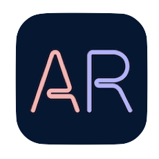

# Beatmap AR

Beat Saber map (a.k.a beatmap) visualizer in AR for iOS.

This is a very early prototype! It's not optimized and a lot of improvements can be made, use at own risk!

## Requirements

- [Xcode 11.3.1](https://developer.apple.com/xcode/) or newer
- [Mint](https://github.com/yonaskolb/Mint) (optional)
- [XcodeGen](https://github.com/yonaskolb/XcodeGen) [2.15.1](https://github.com/yonaskolb/XcodeGen/releases/tag/2.15.1)
- [Carthage](https://github.com/Carthage/Carthage)
- [SwiftLint](https://github.com/realm/SwiftLint) (optional)

## Building

1. Clone this repository

```shell
git clone https://github.com/fabio914/BeatmapAR.git
cd BeatmapAR/
```

2. Run Carthage bootstrap to download and build the project dependencies

```shell
carthage bootstrap
```

3. Run XcodeGen to generate the Xcode project file:

```shell
xcodegen
```

4. Open the Xcode project:

```shell
open Beatmap.xcodeproj/
```

5. Set a "signing team" and create a new provisioning profile;

6. Build and run on an iOS device (**⌘ + R**).

## How to use it

1. Use iTunes (on Windows or older versions of macOS) or Finder (on newer versions of macOS) to transfer your Beat Saber songs to the app. You should transfer the entire song `.zip` file (do not extract and transfer its contents). You can also use iOS' own "share sheet" to copy song `.zip` files from other apps to this app.

2. Open the app, select your song and hit **PLAY**.

## TO-DOs

 - [ ] Start rendering walls;
 - [ ] Optimize how the AR scene gets built and build the map incrementally instead of all at once;
 - [ ] Consider reducing the number of polygons in the block/cube model;
 - [ ] Add an internal web browser to allow the user to download songs from within the app itself;
 - [ ] Add support for other game modes (e.g. 90º, 360º, one saber, etc);

## Contributors

[Fabio Dela Antonio](http://github.com/fabio914)

## Credits

This project depends on [weichsel/ZIPFoundation](https://github.com/weichsel/ZIPFoundation) and it uses a modified version of [Alterplay/APAudioPlayer](https://github.com/Alterplay/APAudioPlayer) (that uses [BASS](http://www.un4seen.com/bass.html)).

Its beatmap definition is based on the [lolPants/beatmap-schemas](https://github.com/lolPants/beatmap-schemas).

It also uses the [Beat Saber Cube](https://www.thingiverse.com/thing:3387776) model created by [Jordan Johston](https://www.thingiverse.com/Godsblade/about) and the [Teko](https://fonts.google.com/specimen/Teko) font.


*This project isn't affiliated with Beat Games nor Beat Saber.*
